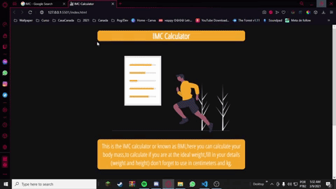
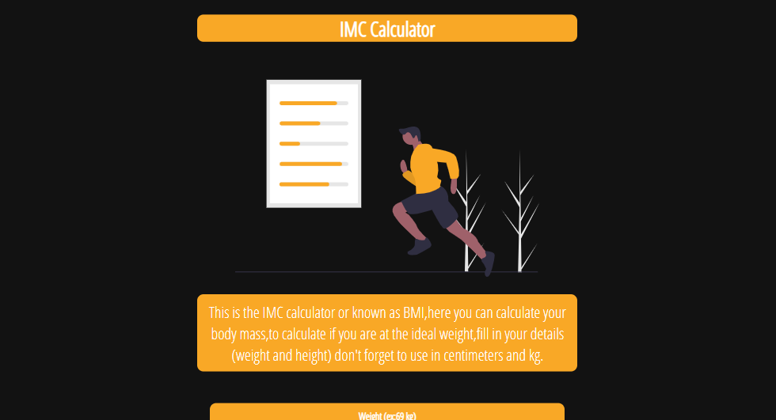
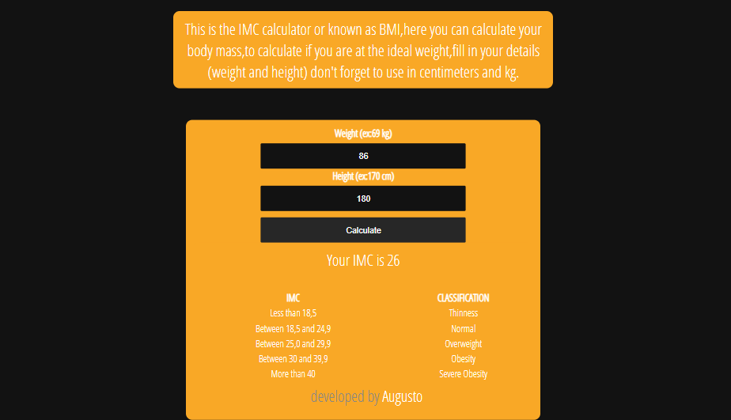
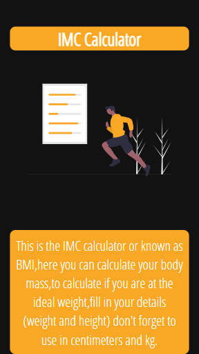
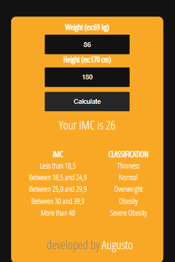

# About (BMI-Calculator)📝

Hello, this is my own project because I recently learned about flexbox and I want to train with my knowledge of JavaScript.This project can calculate you BMI(Body mass index) or in português IMC,
to calculate is easy just put your Weight in kilograms , and your Height in centimeters.
Obs:It is not the final product, I will learn about JQuery and delve into JavaScript to update this project.

# Data 💾
1. Calculate de BMI  (IMC).
2. To calculate the BMI we use weight / height squared.

# Functional example ⚙️

# Preview Desktop 🖥️

# Preview Mobile 📱

